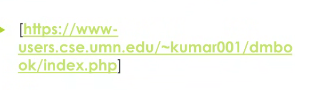
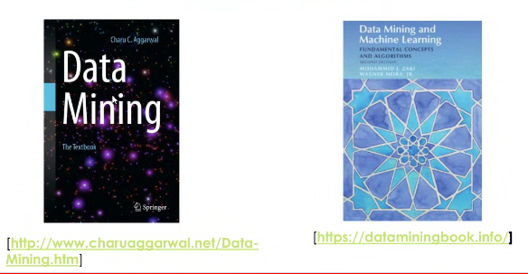
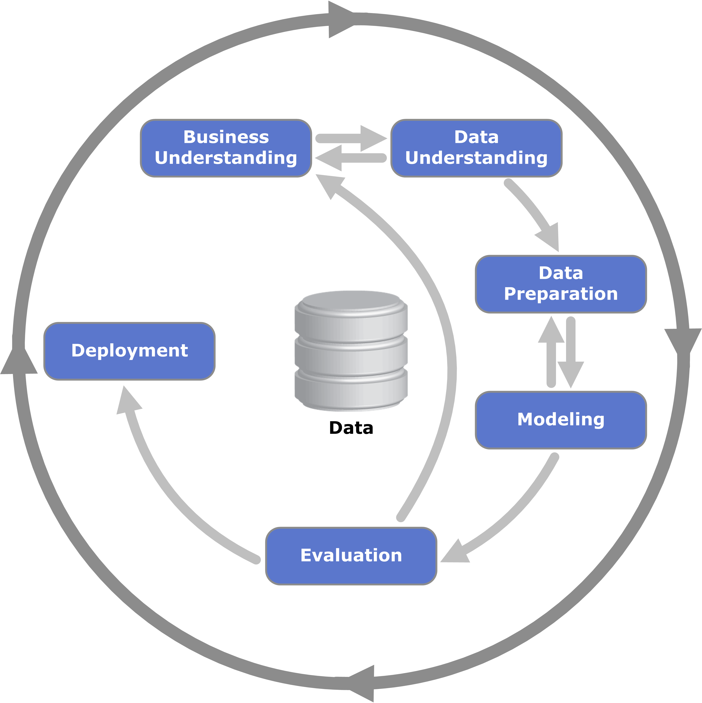
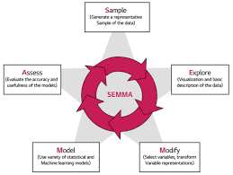
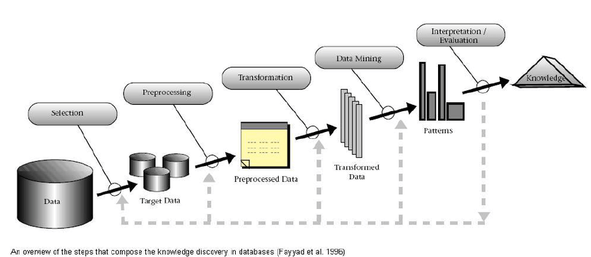
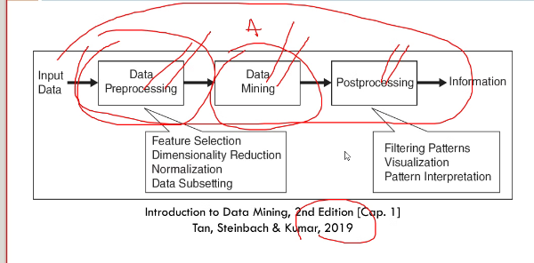

# 11/08 - apresentação e introdução 

avaliacao eh baseada em dois trabalhos em dupla que valem o,3 da nota + um trabalho final individual que vale 0,7 da nota

## referências

ref 1 [livro](../refs/data-mining-global-edition.pdf)

ref 2 

ref 3 

ref 4 [survey-data-mining](https://www.sciencedirect.com/science/article/pii/S1084804524000845)

---

## introdução

### conceitos gerais

>*Big Data*: da suporte à coleta e gerenciamento de grande quantidade de dados, permitindo o armazenamento, processamento e transmissão de dados cada vez maiores.

>Ciência de Dados: auxilia na extração de conhecimento da *Big Data* para utilizar os dados em aplicações de aprendizado de máquina.

>*Data Mining*: é um **processo** (*pipeline*) pelo qual aplicamos algoritmos de ML para extrair padrões a partir de um conjunto de dados.

## metodologias

existem alguns tipos de *pipeline*, os mais utilizados são:

- *Knowledge Discovery in Databases* (KDD): focado na extração de conhecimento
- *Cross INdustry Standard Process for Data Mining* (CRISP-DM): focado no negócio
- *Sample Explores Modify Model Asses* (SEMMA): focado nos modelos

### CRISP-DM

é um ciclo, com o ciclo sendo: (1) compreensão do negócio; (2) compreensão dos dados; (3) preparação de dados; (4) modelação; (5) avaliação; (6) deploy

sendo que entre 1 e 2 o ciclo é de via dupla (vai e volta), assim como de 3 pra 4.

### SEMMA 

é um ciclo contínuo completo, de Sample (amostragem), Explore (visualização e descrição basica dos dados), Modify (seleção de atributos e transformar suas representações), Model (modelos de ML e variação estatística) e Assess (avaliar a acurácia e eficacia dos modelos).

### KDD

data -> seleção -> pré-processamento -> transformação -> *data mining* -> intepretação e avaliação -> conhecimento final

na interpretação, é possível dar passos para tras para qualquer etapa para aprimorar o processamento

### geral
metodologia geral descrita no livro ref 1

dado de entrada -> pré-processamento -> mineração de dados -> pós-processamento -> dados finais

>pré-processamento: seleção de *features*, redução de dimensionalidade, normalização e *subsetting* dos dados

>pós-processamento: filtro de padrões, visualização e interpretação de padrões

---

## *Data Mining: Introduction*
baseado no livro 

### oq é data mining?

tem várias definições, elas variam, ficando associado a extração não trivial de informações não explicitas nos dados, sendo realizada por meio da exporação e análise (automática e semi-automática) de grandes bases de dados

### tarefas de *data mining*

são subdivididas em métodos preditivos (modelos supervisionados) e descritivos (modelos não-supervisionados)

