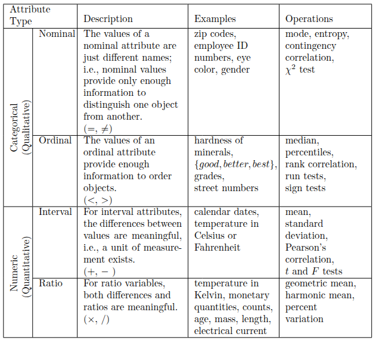

# 18/08 - dados

## types of data

### attributes and object

é uma coleção de objetos de dados e seus atributos. um **atributo** é a propriedade ou características de um objeto. uma coleção de atributos descreve um **objeto**.

**valores dos atributos** podem ser números ou símbolos. distinção entre atributos e valores dos atributos:
- o mesmo atributo pode ser mapeado para diferentes valores de atributos
- diferentes atributo podem ser mapeados para o mesmo conjunto de valores

**medida de comproimento:** a forma que se mede um atributo talvez não seja a correta para as propriedades do atributo. um atributo pode ser medido de uma maneira em que não capture todas as propriedades do atributo.

**tipos de atributos**
- nominais (ex.: ID, cor do olho...)
- ordinais (ex.: altura, notas, ranking...)
- intervalares (não representa a ausência de valor -> ex.: datas de calendário, temperatura em C° ou F°...)
- escalares (representa a ausência de valor -> ex.: temperatura em Kelvin, peso, medição de tempo)

**operações em atributos**
o tipo de operação permitida é baseado no tipo de atributo.
- diferenciadores (= e !=)
- ordem (< > <= >=)
- adição (+ e -)
- multiplicação (* e /)

**atributos binários**
é um *subset* dos nominais, apresentando dois valores (yes/no, true/false).
- simétrico: ambos os valores importam (ex.: gênero)
- assimétrico: os valores não são igualmente importantes (ex.: um booleano que define se um estudante fez ou não uma materia na faculdade, a maioria é 0, o que mais importa é as que ele fez e tem 1)

### types of *data sets*

**características chaves**
- dimensionalidade: nuimero de atributos do objeto
- distribuição: frequência da ocorrência de vários valores, ou conjunto de valores, para os atributos dos objetos de dados.
- resolução: os padrões dos dados dependem do nível de resolução, se a resolução é muito alta, um padrão pode não ser visível ou borrado por *noise*. 

***record data***

- *record data*: forma básica, onde não há relacionamento entre os registros/atributos.

- *transaction or market basket data*: cada registro envolve uma coleção de tiems, muito associado a "dados de uma cesta de mercado"

- *data matrix*: todos objetos tem a mesma quantidade de atributos numéricos, e podem ser interpretados como vetores, que unidos formam uma matriz.

- *sparse data matrix*: os atributos são de mesmo tipo e são assimétricos (apenas valores não nulo importam)

***graph-based data***

tem duas vertentes: (i) o grafo captura a relação entre os objetos; (ii) os objetos de dados representam eles mesmos como grafos.

***ordered data***

- *sequential transaction data*: é uma extensão de transaction data, onde cada transação tem um tempo associado a ela.

- *time series data*: cada registro é uma série temporal.

- *sequence data*: é uma sequência de entidades individuais, como uma sequência de palavras ou letras. 

- *spatial and spatio-temporal data*: objetos que tenham atributos espaciais (posição, área...).

## data quality

## data preprocessingg

aggregation, sampling, feature subset selection, dimensionality reduction, feature creation, discretization and binarization, attribute transformation.

**aggregation**
- combina dois ou mais objetos em um único (perde-se os detalhes)
- ex.: agrupar as transacoes de vendas por loja, por data...
- motivações: redução de dados, mudança de escala, mais "estabilidade" nos dados

**sampling**
- técnica de redução de dados
- usada para investigação preliminar dos dados, evitando altos custos de processamento do conjunto inteiro
- existem varios tipos de amostragem, dividas em dois "grupões": probabilisticas e não-probabilisticas. dentro de ML os tipos mais comuns são:
    - *simple random sampling*: todas instancias tem a mesma prob de serem selecionado, pode ser com/sem substituição (sem: uma vez selecionado aquele item, ele nao pode ser selecionado novamente | com: apos selecionar, nao remove-se a amostra do dataset, entao pode repetir)

    - *statified sampling*: mantém a proporção dos tipos de dados

**feature subset selecion**
- reduz a dimensionaliadde dos dados
- features redundantes e/ou irrelevantes 
- a seleção de features tem como benefícios: reduzir tempo de treinamento; aumentar generalização reduzindo o overfitting;
- técnicas: 
    - brute-force: força bruta mesmo
    - filter: existem vários tipos de filtros, por exemplo, pode-se selecionar os atributos os quais tem a menor correlação entre eles (afasta-se da redundância)
    - wrapper: usa o algoritmo de data mining alvo como uma *black box* para encontrar o melhor subset de atributos, similar a testar todos, porem sem de fato testar todos
    - embedded: o algoritmo do data mining decide quais atributos usar e quais ignorar

**correlação**

 no exemplo de uso de filtros para feature selecion, pode-de medir a correlação de coeficiente de Pearson

