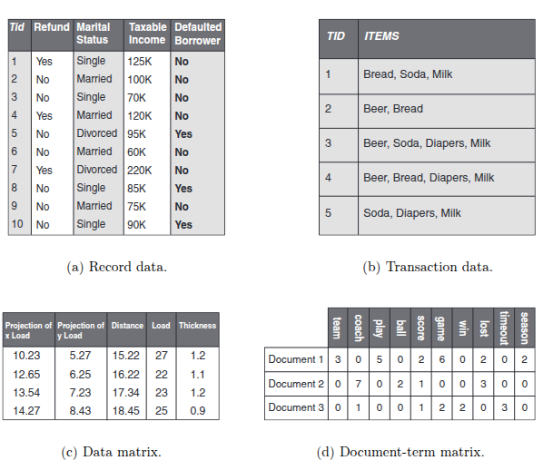
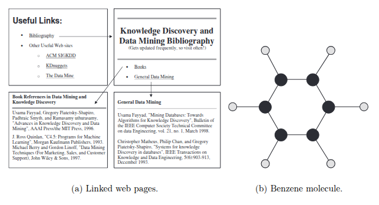
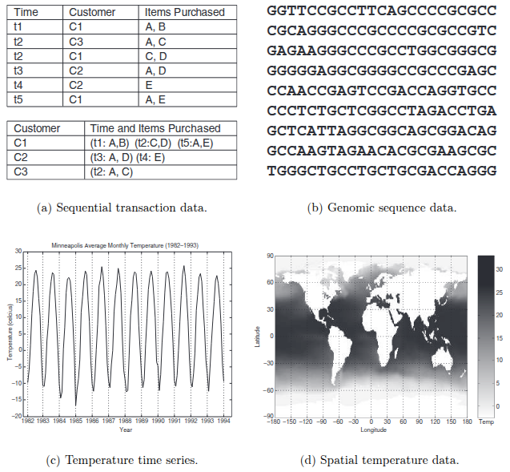
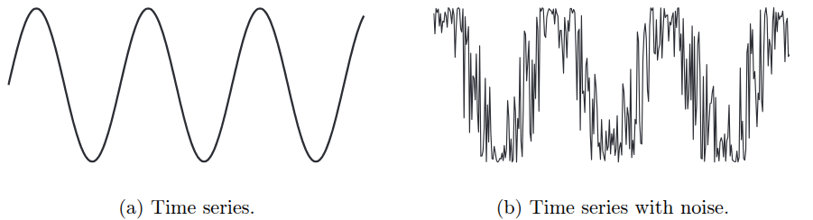
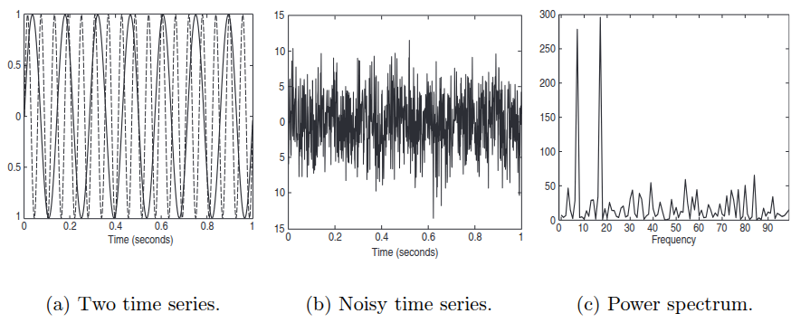

## types of data

### attributes and object

é uma coleção de objetos de dados e seus atributos. um **atributo** é a propriedade ou características de um objeto. uma coleção de atributos descreve um **objeto**.

**valores dos atributos** podem ser números ou símbolos. distinção entre atributos e valores dos atributos:
- o mesmo atributo pode ser mapeado para diferentes valores de atributos
- diferentes atributo podem ser mapeados para o mesmo conjunto de valores

**medida de comproimento:** a forma que se mede um atributo talvez não seja a correta para as propriedades do atributo. um atributo pode ser medido de uma maneira em que não capture todas as propriedades do atributo.

**tipos de atributos**
- nominais (ex.: ID, cor do olho...)
- ordinais (ex.: altura, notas, ranking...)
- intervalares (não representa a ausência de valor -> ex.: datas de calendário, temperatura em C° ou F°...)
- escalares (representa a ausência de valor -> ex.: temperatura em Kelvin, peso, medição de tempo)

**operações em atributos**
o tipo de operação permitida é baseado no tipo de atributo.
- diferenciadores (= e !=)
- ordem (< > <= >=)
- adição (+ e -)
- multiplicação (* e /)

**atributos binários**
é um *subset* dos nominais, apresentando dois valores (yes/no, true/false).
- simétrico: ambos os valores importam (ex.: gênero)
- assimétrico: os valores não são igualmente importantes (ex.: um booleano que define se um estudante fez ou não uma materia na faculdade, a maioria é 0, o que mais importa é as que ele fez e tem 1)

### types of *data sets*

**características chaves**
- dimensionalidade: nuimero de atributos do objeto
- distribuição: frequência da ocorrência de vários valores, ou conjunto de valores, para os atributos dos objetos de dados.
- resolução: os padrões dos dados dependem do nível de resolução, se a resolução é muito alta, um padrão pode não ser visível ou borrado por *noise*. 

***record data***

- *record data*: forma básica, onde não há relacionamento entre os registros/atributos.

- *transaction or market basket data*: cada registro envolve uma coleção de tiems, muito associado a "dados de uma cesta de mercado"

- *data matrix*: todos objetos tem a mesma quantidade de atributos numéricos, e podem ser interpretados como vetores, que unidos formam uma matriz.

- *sparse data matrix*: os atributos são de mesmo tipo e são assimétricos (apenas valores não nulo importam)

***graph-based data***

tem duas vertentes: (i) o grafo captura a relação entre os objetos; (ii) os objetos de dados representam eles mesmos como grafos.

***ordered data***

- *sequential transaction data*: é uma extensão de transaction data, onde cada transação tem um tempo associado a ela.

- *time series data*: cada registro é uma série temporal.

- *sequence data*: é uma sequência de entidades individuais, como uma sequência de palavras ou letras. 

- *spatial and spatio-temporal data*: objetos que tenham atributos espaciais (posição, área...).

---

## data quality

### measurement and data issues

##### measurement and data collection errors

*measurement error* é o erro de medida, onde o valor registrado difere do valor real. 

já o *data collection error* se refere ao erro de campos vazios ou inclusao de objetos que não pertencem ao domínio estudado. 

##### noise and artifacts

*noise* é um erro de medida aleatório. causa a perda do formato de dados espaciais/temporais, e em domínios mais comuns (imagens e sinais) existem formas de remover esses ruídos. porém, na maioria dos casos foca-se em criar algoritmos robustos que produzam resultados aceitáveis mesmo com *noise*.

*artifacts* é um erro causado por um fenômeno determinístico, onde consegue-se encontrar o motivador daquele "ruído", que então é chamado de artefato.

##### precision, bias and accuracy

>*precision:* proximidade entre medidas repetidas de mesma grandeza

>*bias:* variação sistemática das medições em relação à grandeza que está sendo medida

a precisão geralmente é medida pelo desvio padrão, já o bias pela diferença entre a média do conjunto e o valor conhecido da grandeza sendo medida (ex.: lab padrao mediu que a massa é 1g, porem a media das minhas medicoes é 1.001g, então o bias é de 0.001). 

>*accuracy:* proximidade das medidas ao valor verdadeiro da grandeza sendo medida.

os digítos significantes são importantes, onde a quantidade de dígitos deve seguir o limite dos instrumentos de medida utilizados, sem aumentar a precisão sem ter certeza do valor que se está assumindo.

#### outliers

são (i) instancias que tem características diferentes do restantes do conjunto ou (ii) valores de atributos que são incomuns de acordo com valores típicos do atributo. 

são referidos também como anomalias, porém não podem ser confundidos com ruído, onde pode ser dados legitimos que são interessantes em detectar.

#### missing values

a informação pode não ter sido coletada (ex.: alguem negou forneceu sua idade e peso), pode não ser aplicável para todos os objetos e vários outros motivos podem causar a falta de valores. há diversas maneiras para lidar com isso, como por exemplo:
- eliminar instâncias/atributo vazio
- estimando valores (interpolação)
- igmorar valores vazios (ex.: ao calcular a proximidade, não utilziar os campos vazios)

#### inconsistent values

ex.: CEP que não corresponde a cidade atribuída ao objeto. 

existem casos fáceis (altura e peso negativos), porém outros precisam ser consultados em fontes externas. 

#### duplicate data

pode ser duplicatas identicas ou quase identicas. os mesmos dados podem aparecer diversas vezes porem com nomes diferentes. os processos que resolvem isso são chamados de *deduplication*.

### issues related to applications

>"os dados são de alta qualidade se forem utilizados no contexto correto"

#### timeliness

dados que representam valores de determinado período de tempo podem não ter mais qualidade após o período ter passado.  

#### relevance

os dados precisam ter as informações necessárias para a aplicação, com um problema comum sendo o *sampling bias*, em que o recorte escolhido não representa o conjunto todo (perde-se proporções).

#### knowledge about the data

idealmente os conjuntos de dados tem sua documentação, assim possibilitando uma compreensão correta de seus atributos. 

---

## data preprocessing

aggregation, sampling, feature subset selection, dimensionality reduction, feature creation, discretization and binarization, attribute transformation.

### aggregation
- combina dois ou mais objetos em um único (perde-se os detalhes)
- atributos quantitativos são somados ou calculado a média (ex.: preço de vendas)
- atributos categóricos são associadas a uma categoria mais macro (ex.: tv -> eletronicos)
- ex.: agrupar as transacoes de vendas por loja, por data...
- motivações: redução de dados, mudança de escala, mais "estabilidade" nos dados

### sampling
- técnica de redução de dados, escolhe-se um subset dos objetos
- usada para investigação preliminar dos dados, evitando altos custos de processamento do conjunto inteiro
- usar uma amostra representativa funciona da mesma maneira que usar o dataset completo
- existem varios tipos de amostragem, dividas em dois "grupões" (i) probabilisticas e (ii) não-probabilisticas. dentro de ML os tipos mais comuns são:

#### *simple random sampling*

todas instancias tem a mesma prob de serem selecionado, pode ser com/sem substituição (sem: uma vez selecionado aquele item, ele nao pode ser selecionado novamente | com: apos selecionar, nao remove-se a amostra do dataset, entao pode repetir)

a amostragem com substituição (mantendo no dataset) é mais simples de se analizar por conta da probabilidade dos objetos serem escolhidos se manter constante

#### *statified sampling*

quando-se tem diferentes tipos de objetos, com diferentes quantidades para cada tipo, a amostragem randômica não fica representativa (em sua maioria das vezes). nesses casos, usa-se a representação estratificada, a qual tenta manter todas as classes existentes de duas formas: (i) pega a mesma quantidade de todas as classses; (ii) mantem a proporção das classes, cada um com uma quantidade proporcional a divisão original

#### *progressive sampling*

definir o tamanho da amostra pode ser difícil, então uma amostragem adaptativa ou progressiva é utilizada. define-se uma métrica de qualidade do sampling, por exemplo a acc de um modelo para cada amostra.

### dimensionality reduction

data sets com grandes quantidades de features (ex.: conjunto de documentos onde cada documento é representado por um vetor que tem as frequências de cada palavra utilizada no doc). reduzir a dimensionalidade elimina features irrelevantes e reduz ruído.

#### *the curse od dimensionality* 

quanto mais dimensões os dados tem, se torna mais difícil de analisa-los. os dados ficam esparsos no espaço, perdendo representatividade, dificultando para modelos classificatórios e de clustering.

#### *linear algebra techniques for dimensionality reduction*

**Principal Componentes Analysis (PCA)** é uma técnica para atributos contínuos que encontram novos atributos que: (i) são combinação linear de atributos originais; (ii) são ortogonais (perpendiculares) um ao outro; (iii) caputram a quantidade máxima de variação nos dados. 

**Singular Value Decomposition (SVD)** é uma técnica de algebra linear que está relacionado ao PCA e também é utilizado para reduzir dimensionalidade. 

### feature subset selecion
- reduz a dimensionaliadde dos dados
- features redundantes e/ou irrelevantes são removidas 
- a seleção de features tem como benefícios: reduzir tempo de treinamento; aumentar generalização -> reduzindo overfitting;
- atributos irrelevantes e redundantes são fáceis de remover, porém escolher o melhor sub-conjunto de atributos requer abordagens sistemáticas. o ideal seria testar todas as possibildiades, porém tem um custo de com $n$ atributos levar $2^n$ testes.
- por conta disso, existem tres abordagens padrão:
    - *filter*: filtram antes do algoritmo de data mining ser executado. existem vários tipos de filtros, por exemplo, pode-se selecionar os atributos os quais tem a menor correlação entre eles (afasta-se da redundância)
    - *wrapper*: usa o algoritmo de data mining alvo como uma *black box* para encontrar o melhor subset de atributos, similar a testar todos, porem sem de fato testar todos
    - *embedded*: durante a operação do algoritmo de data mining, o algoritmo do data mining decide quais atributos usar e quais ignorar

#### *an architecture for feature subset selection*

é possível incorporar a abordagem por filtro e por wrapper dentro da mesma arquitetura. 

o processo de seleção de features tem quatro partes: (i) medida de avaliação de um subset; (ii) estratégia de busca que controla a geração de novos subsets de features; (iii) critério de parada; e (iv) procedimento de validação;

filter e wrapper se diferem apenas na avaliação dos subsets, onde o wrapper avalia como algoritmo de data mining, já o filtro é distinto do algoritmo de data mining.

as *search strategies* são diversas, idealmente deveriam ser leves computacionalmente e encontrar o conjunto ótimo (ou próximo de) de features.   

a avaliação precisa de uma métrica que determine a qualidade do subset dado a tarefa de data mining em uso. para filtros, a avaliação tenta prever quão bem se sairá o conjunto, já para o wrapper roda-se o algoritmo e usa-se sua medida avaliativa. 

critério de parada são baseadas em uma ou mais das seguintes condições: (i) n° de iterações; (ii) quando a métrica é ótima ou excede o threshold; (iii) quando um subset de determinado tamanho tenha sido obtido; e (iv) quando qualquer melhora pode ser atingida pelas opções de avaliação da *search strategy*.

após selecionar o subset, a validação final compara o algoritmo de data mining com o conjunto completo com o subset encontrado. 

#### feature weighting

quão mais importante a feature, maior seu peso. pesos são dados baseado no conhecimento das features, ou podem ser atribuidos automaticamente. 

### feature creation

pode-se criar atributos para reduzir o total de atributos de um conjunto, visando manter os dados mais importantes. esse processo é específico por domínio, sendo raro a utilização de uma técnica em mais de um domínio. existem duas metodologias gerais:

- *feature extraction*: é a criação de novas features a partir do conjunto cru. ex.: artefatos históricos que originalmente tinha volume e massa para cada material que é constituido, então combina-se eles e cria-se a densidade pra cada material, assim reduzindo de 2 para 1 atributo.

- *mapping the data to a new space*: é a mudança dos dados, criando novas visões sobre o conjunto. ex.: utilização de transformada de fourier para entender o padrões complexos.

### discretization and binarization

